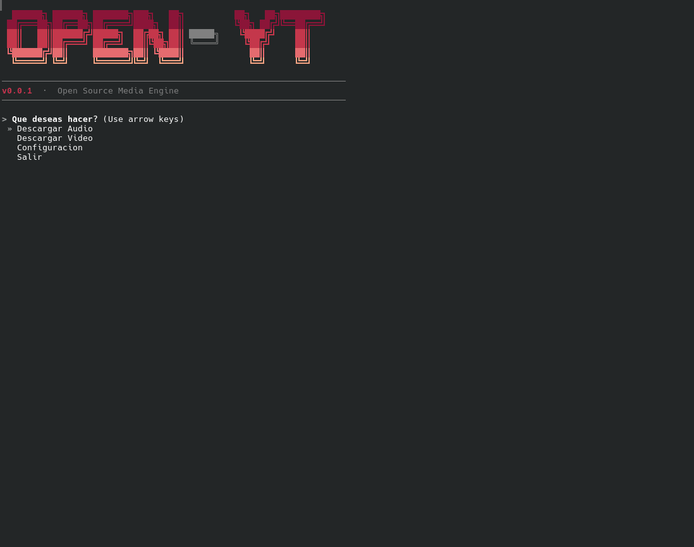

# OPEN-YT 🟥

> The high-performance, minimalist open-source YouTube engine for audio and video.

[](https://www.python.org/downloads/)
[](https://opensource.org/licenses/MIT)
[](https://pyinstaller.org/)



OPEN-YT es una Interfaz de Línea de Comandos (CLI) de grado industrial diseñada para extraer audio y video con la máxima eficiencia. Combina la potencia de `yt-dlp` con una experiencia de usuario (UX) minimalista, elegante y altamente configurable.

## ✨ Características

* **UI/UX Premium:** Interfaz de terminal renderizada con `Rich` y menús interactivos fluidos potenciados por `Questionary`.
* **Motor Asíncrono:** Descargas ultra rápidas y extracción de metadatos sin bloquear la interfaz.
* **Persistencia de Estado:** Recuerda tus preferencias de formato (MP3, FLAC, MP4, MKV), resolución y rutas de descarga localmente.
* **Multiplataforma y Portable:** Distribuido como un binario único. Cero dependencias requeridas para el usuario final.

---


## 🚀 Instalación (Recomendada)

Puedes instalar OPEN-YT globalmente en tu sistema en cuestión de segundos utilizando gestores de herramientas modernas de Python como `uv` o `pipx` (recomendado para no ensuciar tu entorno local):

Usando **uv** (Más rápido):
```bash
uv tool install open-yt

Usando **pip** (Más usada):
```bash
pip install open-yt


---

## 💻 Instalación para Desarrolladores

Si deseas explorar el código fuente, modificar la herramienta o compilarla tú mismo:

```bash
# 1. Clonar el repositorio
git clone https://github.com/elisbanpaco/open-yt.git
cd open-yt

# 2. Crear el entorno virtual e instalar dependencias
uv sync

# 3. Ejecutar
uv run open-yt